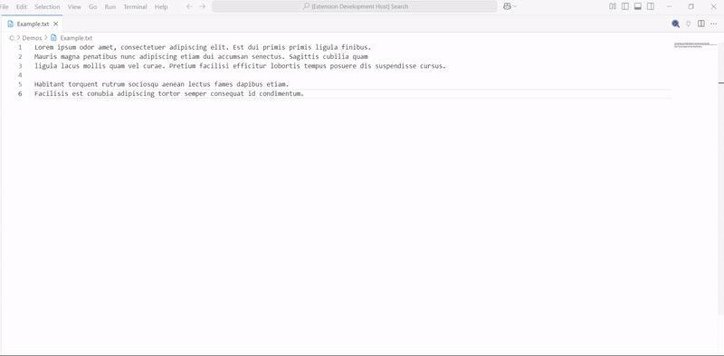
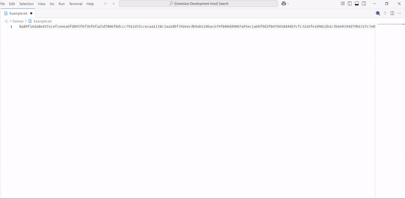

# Cyphile

Cyphile is an extention that enrypts and decrypts files.

## Features

- Enrypt the currently openned file on the editor.
- Decrypt the currently openned file on the editor.

## Usage

**Encrypt a file**

- Open the command palatte - `Shift + Command + P (Mac)` / `Ctrl + Shift + P (Windows/Linux)`
- Find the encryption command - `cyphile: cypher` / `cypher`
- Enter a _password/key_ to protect the file
  

**Decrypt a file**

- Open the command palatte - `Shift + Command + P (Mac)` / `Ctrl + Shift + P (Windows/Linux)`
- Find the decryption command - `cyphile:decypher` / `decypher`
- Enter the _password/key_ used to protect the file
  

## Dependencies

The extension use [cryptr](https://www.npmjs.com/package/cryptr) for encryption and decryption purposes.

## Release Notes

> ### 1.0.0 - _Wordbreaker_ (08/02/2025)
>
> Initial release.
>
> Features added:
> - Encrypt a file
> - Decrypt a file

