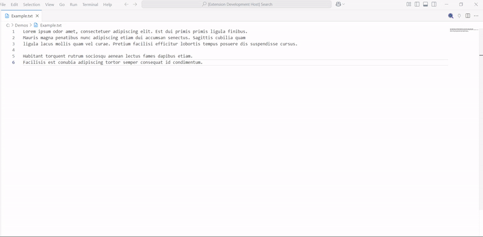
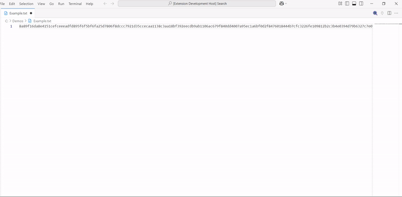
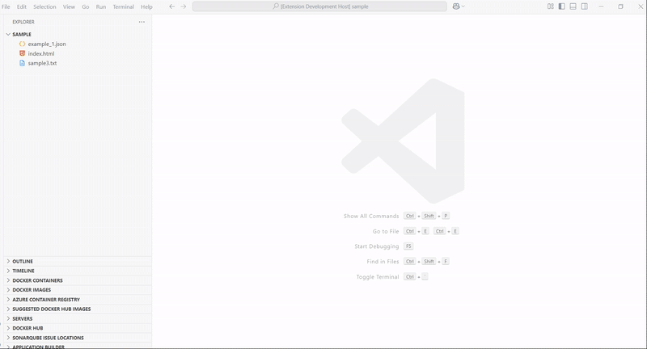
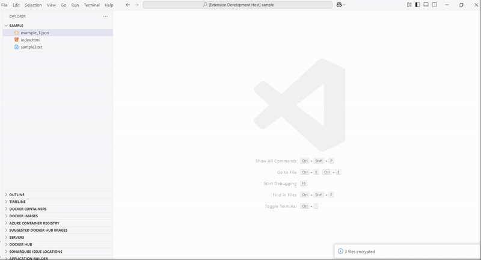

# Cyphile

Cyphile is an extention that enrypts and decrypts files.

## Features

- Enrypt the currently openned file in the editor.
- Decrypt the currently openned file in the editor.
- Enrypt files in a directory (excluding sub-directories).
- Decrypt files in a directory (excluding sub-directories).

## Usage

**Encrypt a file**

- Open the command palatte - `Shift + Command + P (Mac)` / `Ctrl + Shift + P (Windows/Linux)`
- Find the encryption command - `cyphile:cypher` / `cypher`
- Enter a _secret_ to protect the file
  

**Decrypt a file**

- Open the command palatte - `Shift + Command + P (Mac)` / `Ctrl + Shift + P (Windows/Linux)`
- Find the decryption command - `cyphile:decypher` / `decypher`
- Enter the _secret_ used to protect the file
  

**Encrypt a directory**

- Open the command palatte - `Shift + Command + P (Mac)` / `Ctrl + Shift + P (Windows/Linux)`
- Find the encrypt directory command - `cyphile:cypher directory` / `cypher directory`
- Select a folder/directory
- Enter a _secret_ to protect the files
  

  **Decrypt a directory**

- Open the command palatte - `Shift + Command + P (Mac)` / `Ctrl + Shift + P (Windows/Linux)`
- Find the decrypt directory command - `cyphile:decypher directory` / `decypher directory`
- Select a folder/directory
- Enter the _secret_ used to protect the files
  

## Dependencies

The extension use [cryptr](https://www.npmjs.com/package/cryptr) for encryption and decryption purposes.

## Release Notes

> ### 1.0.0 - (08/02/2025)
>
> Initial release.
>
> Features added:
> - Encrypt a file
> - Decrypt a file

> ### 1.1.0 - (02/03/2025)
>
> Added new features.
>
> Features added:
> - Encrypt all files in a directory (excluding sub-directories)
> - Decrypt all files in a directory (excluding sub-directories)

